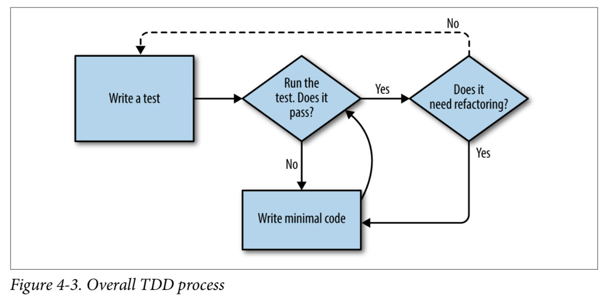
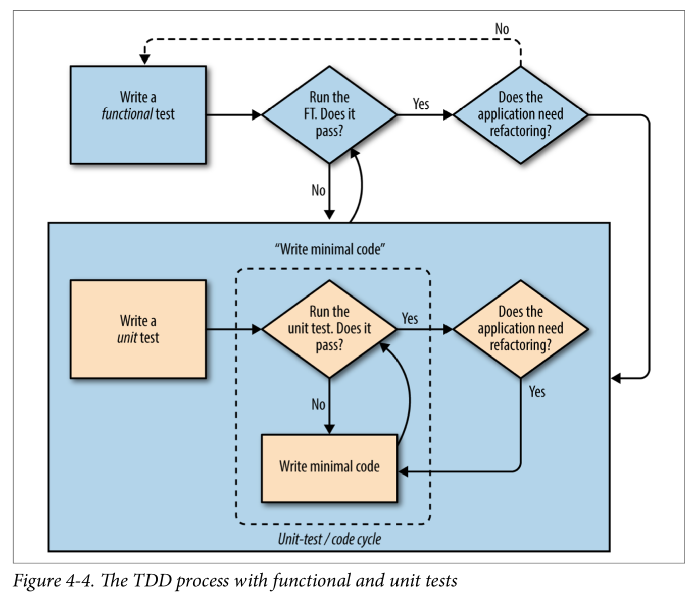

## TDD Process

The main aspects of the TDD process:

- Functional tests
- Unit tests
- The unit-test/code cycle
- Refactoring

We write a test. We run the test and see it fail. We write some minimal code to get it a little further. We rerun the test and repeat until it passes. Then, optionally, we might refactor our code, using our tests to make sure we don’t break anything.

But how does this apply when we have functional tests and unit tests? Well, you can think of the functional test as being a high-level view of the cycle, where “writing the code” to get the functional tests to pass actually involves using another, smaller TDD cycle which uses unit tests.

We write a functional test and see it fail. Then, the process of “writing code” to get it to pass is a mini-TDD cycle of its own: we write one or more unit tests, and go into the unit-test/code cycle until the unit tests pass. Then, we go back to our FT to check that it gets a little further, and we can write a bit more of our application—using more unit tests, and so on.

What about refactoring, in the context of functional tests? Well, that means we use the functional test to check that we’ve preserved the behaviour of our application, but we can change or add and remove unit tests, and use a unit test cycle to actually change the implementation.

The functional tests are the ultimate judge of whether your application works or not. The unit tests are a tool to help you along the way.

This way of looking at things is sometimes called “Double-Loop TDD”.
