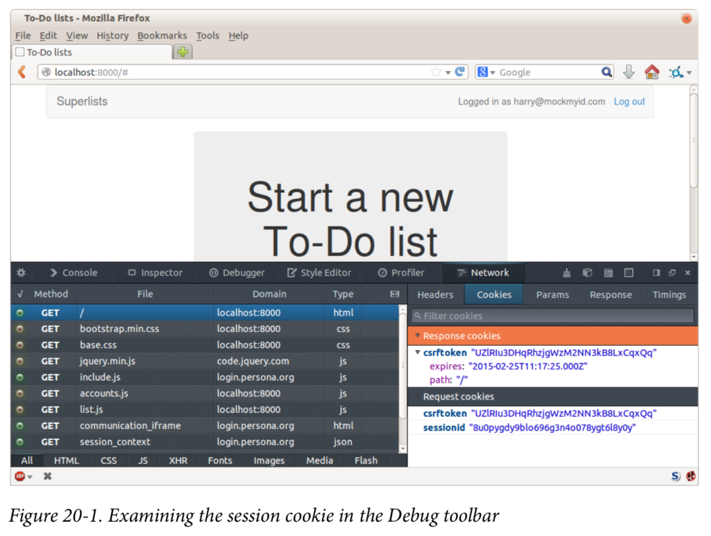
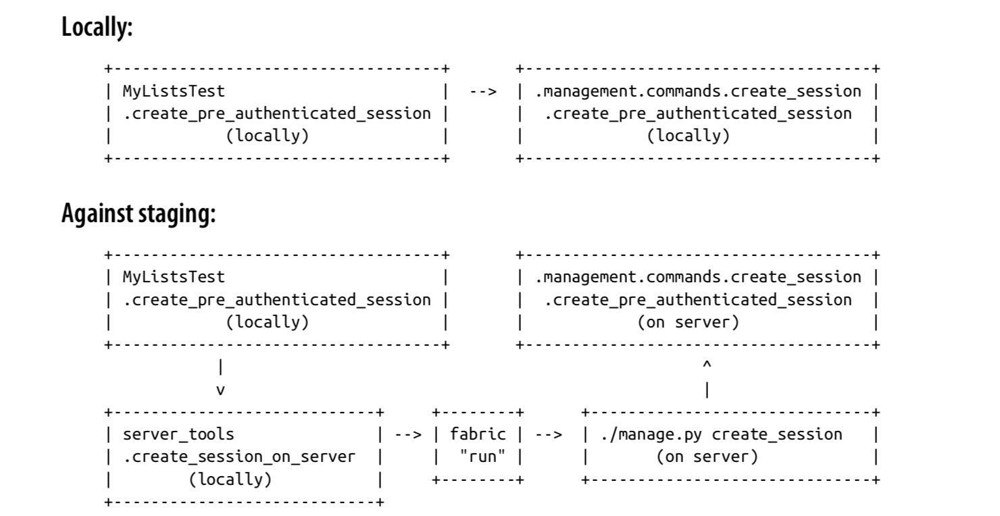

## TDD Process

The main aspects of the TDD process:

- Functional tests
- Unit tests
- The unit-test/code cycle
- Refactoring

We write a test. We run the test and see it fail. We write some minimal code to get it a little further. We rerun the test and repeat until it passes. Then, optionally, we might refactor our code, using our tests to make sure we don’t break anything.


But how does this apply when we have functional tests and unit tests? Well, you can think of the functional test as being a high-level view of the cycle, where “writing the code” to get the functional tests to pass actually involves using another, smaller TDD cycle which uses unit tests.


We write a functional test and see it fail. Then, the process of “writing code” to get it to pass is a mini-TDD cycle of its own: we write one or more unit tests, and go into the unit-test/code cycle until the unit tests pass. Then, we go back to our FT to check that it gets a little further, and we can write a bit more of our application—using more unit tests, and so on.

What about refactoring, in the context of functional tests? Well, that means we use the functional test to check that we’ve preserved the behaviour of our application, but we can change or add and remove unit tests, and use a unit test cycle to actually change the implementation.

The functional tests are the ultimate judge of whether your application works or not. The unit tests are a tool to help you along the way.

This way of looking at things is sometimes called “Double-Loop TDD”.

## collectstatic and Other Static Directories

Django dev server will magically find all your static files inside app folders, and serve them for you. That’s fine during development, but when you’re running on a real web server, you don’t want Django serving your static content— using Python to serve raw files is slow and inefficient, and a web server like Apache or Nginx can do this all for you. You might even decide to upload all your static files to a CDN, instead of hosting them yourself.

For these reasons, you want to be able to gather up all your static files from inside their various app folders, and copy them into a single location, ready for deployment. This is what the **collectstatic** command is for.

The destination, the place where the collected static files go, is defined in _settings.py_ as STATIC_ROOT.

We’ll change its value to a folder just outside our repo— I’m going to make it a folder just next to the main source folder:

```
workspace
│ ├── superlists
│ │ ├── lists
│ │ │ ├── models.py │││
│ │ ├── manage.py
│ │ ├── superlists ││
│ ├── static
│ │ ├── base.css
│ │ ├── etc...
```

The logic is that the static files folder shouldn’t be a part of your repository—we don’t want to put it under source control, because it’s a duplicate of all the files that are inside lists/static.

Here’s a neat way of specifying that folder, making it relative to the location of the project base directory:

        # Static files (CSS, JavaScript, Images)
        # https://docs.djangoproject.com/en/1.11/howto/static-files/

        STATIC_URL = '/static/'
        STATIC_ROOT = os.path.abspath(os.path.join(BASE_DIR, '../static'))

Take a look at the top of the settings file, and you’ll see how that BASE_DIR variable is helpfully defined for us, using **file** (which itself is a really, really useful Python built-in).

Anyway, let’s try running collectstatic:

        \$ python manage.py collectstatic
        [...]
        Copying '/.../superlists/lists/static/bootstrap/css/
        bootstrap-theme.css' Copying '/.../superlists/lists/static/
        bootstrap/css/bootstrap.min.css'

        76 static files copied to '/.../static'.

And if we look in ../static, we’ll find all our CSS files:

```
\$ tree ../static/ ../static/
├── admin
│ ├── css
│ │ ├── base.css
[...]
│
├── base.css
└── bootstrap
└── xregexp.min.js
├── css
│ ├── bootstrap.css
│ ├── bootstrap.css.map
│ ├── bootstrap.min.css
│ ├── bootstrap-theme.css
│ ├── bootstrap-theme.css.map
│ └── bootstrap-theme.min.css
├── fonts
│ ├── glyphicons-halflings-regular.eot
│ ├── glyphicons-halflings-regular.svg
│ ├── glyphicons-halflings-regular.ttf
│ ├── glyphicons-halflings-regular.woff
│ └── glyphicons-halflings-regular.woff2
└── js
├── bootstrap.js
├── bootstrap.min.js
└── npm.js
14 directories, 76 files
```

## Server Debugging Tips

Deployments are tricky! If ever things don’t go exactly as expected, here are a few tips and things to look out for:

- I’m sure you already have, but double-check that each file is exactly where it should be and has the right contents—a single stray character can make all the difference.
- Nginx error logs go into /var/log/nginx/error.log.
- You can ask Nginx to “check” its config using the -t flag: nginx -t
- Make sure your browser isn’t caching an out-of-date response. Use Ctrl-Refresh, or start a new private browser window.
- This may be clutching at straws, but I’ve sometimes seen inexplicable behaviour on the server that’s only been resolved when I fully restarted it with a sudo reboot.

If you ever get completely stuck, there’s always the option of blowing away your server and starting again from scratch! It should go faster the second time...

## Test-Driving Server Configuration and Deployment

- Tests take some of the uncertainty out of deployment

  For developers, server administration is always “fun”, by which I mean, a process full of uncertainty and surprises. My aim during this chapter was to show that a functional test suite can take some of the uncertainty out of the process.

- Typical pain points - database, static files, dependencies, custom settings

  The things that you need to keep an eye out for on any deployment include your database configuration, static files, software dependencies, and custom settings that differ between development and production. You’ll need to think through each of these for your own deployments.

- Tests allow us to experiment

  Whenever we make a change to our server configuration, we can rerun the test suite, and be confident that everything works as well as it did before. It allows us to experiment with our setup with less fear.

## More Debugging Tips

- Check the Systemd logs for using sudo journalctl -u gunicorn-superlists-staging.ajprojects.xyz.
- You can ask Systemd to check the validity of your service configuration: systemd-analyze verify /path/to/my.service.
- Remember to restart both services whenever you make changes.
- If you make changes to the Systemd config file, you need to run daemon-reload before systemctl restart to see the effect of your changes.

## Producion-Readiness for Server Deployments

A few things to think about when trying to build a production-ready server environment:

- Don’t use the Django dev server in production

  Something like Gunicorn or uWSGI is a better tool for running Django; they will let you run multiple workers, for example.

- Don’t use Django to serve your static files

  There’s no point in using a Python process to do the simple job of serving static files. Nginx can do it, but so can other web servers like Apache or uWSGI.

- Check your settings.py for dev-only settings
  DEBUG=True and ALLOWED_HOSTS are the two we looked at, but you will probably have others (send emails from the server).

- Security

## Tips on Organising Tests and Refactoring

### Use a tests folder

Just as you use multiple files to hold your application code, you should split your tests out into multiple files.

- For functional tests, group them into tests for a particular feature or user story.
- For unit tests, use a folder called tests, with a \_\_init\_\_.py.
- You probably want a separate test file for each tested source code file. For Django, that’s typically test_models.py, test_views.py, and test_forms.py.
- Have at least a placeholder test for every function and class.

### Don’t forget the “Refactor” in “Red, Green, Refactor”

The whole point of having tests is to allow you to refactor your code! Use them, and make your code (including your tests) as clean as you can.

### Don’t refactor against failing tests

- In general!
- But the FT you’re currently working on doesn’t count.
- You can occasionally put a skip on a test which is testing something you haven’t written yet.
- More commonly, make a note of the refactor you want to do, finish what you’re working on, and do the refactor a little later, when you’re back to a working state.
- Don’t forget to remove any skips before you commit your code! You should always review your diffs line by line to catch things like this.

### Try a generic wait_for helper

Having specific helper methods that do explicit waits is great, and it helps to make your tests readable. But you’ll also often need an ad-hoc one-line assertion or Selenium interaction that you’ll want to add a wait to. self.wait_for does the job well for me, but you might find a slightly different pattern works for you.

## On Database-Layer Validation

I always like to push my validation logic down as low as possible.

### Validation at the database layer is the ultimate guarantee of data integrity

It can ensure that, no matter how complex your code at the layers above gets, you have guarantees at the lowest level that your data is valid and consistent.

### But it comes at the expense of flexibility

This benefit doesn’t come for free! It’s now impossible, even temporarily, to have inconsistent data. Sometimes you might have a good reason for temporarily storing data that breaks the rules rather than storing nothing at all. Perhaps you’re importing data from an external source in several stages, for example.

### And it’s not designed for user-friendliness

Trying to store invalid data will cause a nasty IntegrityError to come back from your database, and possibly the user will see a confusing 500 error page. As we’ll see in later chapters, forms-layer validation is designed with the user in mind, anticipating the kinds of helpful error messages we want to send them.

## Tips

### Thin Views

If you find yourself looking at complex views, and having to write a lot of tests for them, it’s time to start thinking about whether that logic could be moved else‐where:

- possibly to a form, like we’ve done here.
- Another possible place would be a custom method on the model class.
- And once the complexity of the app demands it—out of Django-specific files and into your own classes and functions, that capture your core business logic.

### Each test should test one thing

The heuristic is to be suspicious if there’s more than one assertion in a test. Sometimes two assertions are closely related, so they belong together. But often your first draft of a test ends up testing multiple behaviours, and it’s worth rewriting it as several tests. Helper functions can keep them from getting too bloated.

## JavaScript Testing in the TDD Cycle

You may be wondering how these JavaScript tests fit in with our “double loop” TDD cycle. The answer is that they play exactly the same role as our Python unit tests.

1. Write an FT and see it fail.
2. Figure out what kind of code you need next: Python or JavaScript?
3. Write a unit test in either language, and see it fail.
4. Write some code in either language, and make the test pass.
5. Rinse and repeat.

## Exploratory Coding, Spiking, and De-spiking

### Spiking

Exploratory coding to find out about a new API, or to explore the feasibility of a new solution. Spiking can be done without tests. It’s a good idea to do your spike on a new branch, and go back to master when de-spiking.

### De-spiking

Taking the work from a spike and making it part of the production codebase. The idea is to throw away the old spike code altogether, and start again from scratch, using TDD once again. De-spiked code can often come out looking quite different from the original spike, and usually much nicer.

### Writing your FT against spiked code

Whether or not this is a good idea depends on your circumstances. The reason it can be useful is because it can help you write the FT correctly—figuring out how to test your spike can be just as challenging as the spike itself. On the other hand, it might constrain you towards reimplementing a very similar solution to your spiked one—something to watch out for.

## On Mocking in Python

### Mocking and external dependencies

We use mocking in unit tests when we have an external dependency that we don’t want to actually use in our tests. A mock is used to simulate the third-party API. Whilst it is possible to “roll your own” mocks in Python, a mocking framework like the mock module provides a lot of helpful shortcuts which will make it easier to write (and more importantly, read) your tests.

### Monkeypatching

Replacing an object in a namespace at runtime. We use it in our unit tests to replace a real function which has undesirable side effects with a mock object, using the patch decorator.

### The Mock library

Michael Foord (who used to work for the company that spawned PythonAny‐ where, just before I joined) wrote the excellent “Mock” library that’s now been integrated into the standard library of Python 3. It contains most everything you might need for mocking in Python.

### The patch decorator

unittest.mock provides a function called patch, which can be used to “mock out” any object from the module you’re testing. It’s commonly used as a decorator on a test method, or even at the class level, where it’s applied to all the test methods of that class.

### Mocks can leave you tightly coupled to the implementation

Mocks can leave you tightly coupled to your implementation. For that reason, you shouldn’t use them unless you have a good reason.

### Mocks can save you from duplication in your tests

On the other hand, there’s no point in duplicating all of your tests for a function inside a higher-level piece of code that uses that function. Using a mock in this case reduces duplication.

## Django Sessions: How a User's Cookies Tell the Server She is Authenticated

Because HTTP is stateless, servers need a way of recognising different clients with every _single request_. IP addresses can be shared, so the usual solution is to give each client a unique session ID, which it will store in a cookie, and submit with every request. The server will store that ID somewhere (by default, in the database), and then it can recognise each request that comes in as being from a particular client.
If you log in to the site using the dev server, you can actually take a look at your session ID by hand if you like. It’s stored under the key sessionid by default. See Figure 20-1.



These session cookies are set for all visitors to a Django site, whether they’re logged in or not.

When we want to recognise a client as being a logged-in and authenticated user, again, rather asking the client to send their username and password with every single request, the server can actually just mark that client’s session as being an authenticated session, and associate it with a user ID in its database.

A session is a dictionary-like data structure, and the user ID is stored under the key given by django.contrib.auth.SESSION_KEY. You can check this out in a ./manage.py shell if you like:

    $ python manage.py shell
    [...]
    In [1]: from django.contrib.sessions.models import Session

    # substitute your session id from your browser cookie here
    In [2]: session = Session.objects.get(
      session_key="8u0pygdy9blo696g3n4o078ygt6l8y0y"
    )

    In [3]: print(session.get_decoded())
    {'\_auth_user_id': 'obeythetestinggoat@gmail.com', '\_auth_user_backend': 'accounts.authentication.PasswordlessAuthenticationBackend'}

You can also store any other information you like on a user’s session, as a way of tem‐ porarily keeping track of some state. This works for non–logged-in users too. Just use request.session inside any view, and it works as a dict.

## Lessons Learned

### Decorators are nice

Decorators can be a great way of abstracting out different levels of concerns. They let us write our test assertions without having to think about waits at the same time.

### De-duplicate your FTs, with caution

Every single FT doesn’t need to test every single part of your application. In our case, we wanted to avoid going through the full login process for every FT that needs an authenticated user, so we used a test fixture to “cheat” and skip that part. You might find other things you want to skip in your FTs. A word of caution, however: functional tests are there to catch unpredictable interactions between different parts of your application, so be wary of pushing de-duplication to the extreme.

### Test fixtures

Test fixtures refers to test data that needs to be set up as a precondition before a test is run—often this means populating the database with some information, but as we’ve seen (with browser cookies), it can involve other types of preconditions.

### Avoid JSON fixtures

Django makes it easy to save and restore data from the database in JSON format (and others) using the dumpdata and loaddata management commands. Most people recommend against using these for test fixtures, as they are painful to manage when your database schema changes. Use the ORM, or a tool like [factory_boy](https://factoryboy.readthedocs.org/).

## Recap: Creating Session Locally Versus Staging



I’ve shown one way of managing the test database, but you could experiment with others—for example, if you were using MySQL or Postgres, you could open up an SSH tunnel to the server, and use port forwarding to talk to the database directly. You could then amend settings.DATABASES during FTs to talk to the tunnelled port.

## Warning: Be Careful Not to Run Test Code Against the Live Server

We’re into dangerous territory, now that we have code that can directly affect a database on the server. You want to be very, very careful that you don’t accidentally blow away your production database by running FTs against the wrong host.

You might consider putting some safeguards in place at this point. For example, you could put staging and production on different servers, and make it so they use different keypairs for authentication, with different passphrases.

This is similarly dangerous territory to running tests against clones of production data.

## Lessons Learned Catching Bugs in Staging

### Fixtures also have to work remotely

LiveServerTestCase makes it easy to interact with the test database using the Django ORM for tests running locally. Interacting with the database on the staging server is not so straightforward. One solution is Fabric and Django manag ment commands, as I’ve shown, but you should explore what works for you— SSH tunnels, for example.

### Be very careful when resetting data on your servers

A command that can remotely wipe the entire database on one of your servers is a dangerous weapon, and you want to be really, really sure it’s never accidentally going to hit your production data.

### Logging is critical to debugging issues on the server

At the very least, you’ll want to be able to see any error messages that are being generated by the server. For thornier bugs, you’ll also want to be able to do the occasional “debug print”, and see it end up in a file somewhere.

## The Alternative: "Inside-Out"

The alternative to “outside-in” is to work “inside-out”, which is the way most people intuitively work before they encounter TDD. After coming up with a design, the natural inclination is sometimes to implement it starting with the innermost, lowest- level components first.

For example, when faced with our current problem, providing users with a “My Lists” page of saved lists, the temptation is to start by adding an “owner” attribute to the List model object, reasoning that an attribute like this is “obviously” going to be required. Once that’s in place, we would modify the more peripheral layers of code, such as views and templates, taking advantage of the new attribute, and then finally add URL routing to point to the new view.

It feels comfortable because it means you’re never working on a bit of code that is dependent on something that hasn’t yet been implemented. Each bit of work on the inside is a solid foundation on which to build the next layer out.

But working inside-out like this also has some weaknesses.

## Why Prefer “Outside-In”?

The most obvious problem with inside-out is that it requires us to stray from a TDD workflow. Our functional test’s first failure might be due to missing URL routing, but we decide to ignore that and go off adding attributes to our database model objects instead.

We might have ideas in our head about the new desired behaviour of our inner layers like database models, and often these ideas will be pretty good, but they are actually just speculation about what’s really required, because we haven’t yet built the outer layers that will use them.

One problem that can result is to build inner components that are more general or more capable than we actually need, which is a waste of time, and an added source of complexity for your project. Another common problem is that you create inner components with an API which is convenient for their own internal design, but which later turns out to be inappropriate for the calls your outer layers would like to make... worse still, you might end up with inner components which, you later realise, don’t actually solve the problem that your outer layers need solved.

In contrast, working outside-in allows you to use each layer to imagine the most convenient API you could want from the layer beneath it.

> Outside-In TDD is sometimes called “programming by wishful thinking”, and you can see why. We start writing code at the higher levels based on what we wish we had at the lower levels, even though it doesn’t exist yet!

## Outside-In TDD

### Outside-In TDD

A methodology for building code, driven by tests, which proceeds by starting from the “outside” layers (presentation, GUI), and moving “inwards” step by step, via view/controller layers, down towards the model layer. The idea is to drive the design of your code from the use to which it is going to be put, rather than trying to anticipate requirements from the ground up.

### Programming by wishful thinking

The outside-in process is sometimes called “programming by wishful thinking”. Actually, any kind of TDD involves some wishful thinking. We’re always writing tests for things that don’t exist yet.

### The pitfalls of outside-in

Outside-in isn’t a silver bullet. It encourages us to focus on things that are immediately visible to the user, but it won’t automatically remind us to write other critical tests that are less user-visible—things like security, for example. You’ll need to remember them yourself.

## When to Write Isolated Versus Integrated Tests

Django’s testing tools make it very easy to quickly put together integrated tests. The test runner helpfully creates a fast, in-memory version of your database and resets it for you in between each test. The TestCase class and the test client make it easy to test your views, from checking whether database objects are modified, confirming that your URL mappings work, and inspecting the rendering of the templates. This lets you get started with testing very easily and get good coverage across your whole stack.

On the other hand, these kinds of integrated tests won’t necessarily deliver the full benefit that rigorous unit testing and Outside-In TDD are meant to confer in terms of design.

If we look at the example in this chapter, compare the code we had before and after:

    def new*list(request):
      form = ItemForm(data=request.POST)
      if form.is_valid():
        list* = List()
        if not isinstance(request.user, AnonymousUser):
          list*.owner = request.user
        list*.save()
        form.save(for*list=list*)
        return redirect(list*)
      else:
        return render(request, 'home.html', {"form": form})

    def new_list(request):
      form = NewListForm(data=request.POST)
      if form.is_valid():
        list* = form.save(owner=request.user)
        return redirect(list\_)
      return render(request, 'home.html', {'form': form})

If we hadn’t bothered to go down the isolation route, would we have bothered to refactor the view function? I know I didn’t in the first draft of this book. I’d like to think I would have “in real life”, but it’s hard to be sure. But writing isolated tests does make you very aware of where the complexities in your code lie.

### Let Complexity Be Your Guide

I’d say the point at which isolated tests start to become worth it is to do with complexity. The example in this book is extremely simple, so it’s not usually been worth it so far. Even in the example in this chapter, I can convince myself I didn’t really need to write those isolated tests.

But once an application gains a little more complexity—if it starts growing any more layers between views and models, if you find yourself writing helper methods, or if you’re writing your own classes, then you will probably gain from writing more iso‐ lated tests.

### Should You Do Both?

We already have our suite of functional tests, which will serve the purpose of telling us if we ever make any mistakes in integrating the different parts of our code together. Writing isolated tests can help us to drive out better design for our code, and to verify correctness in finer detail. Would a middle layer of integration tests serve any additional purpose?

I think the answer is potentially yes, if they can provide a faster feedback cycle, and help you identify more clearly what integration problems you suffer from—their tracebacks may provide you with better debug information than you would get from a functional test, for example.

There may even be a case for building them as a separate test suite—you could have one suite of fast, isolated unit tests that don’t even use manage.py, because they don’t need any of the database cleanup and teardown that the Django test runner gives you, and then the intermediate layer that uses Django, and finally the functional tests layer that, say, talks to a staging server. It may be worth it if each layer delivers incremental benefits.

It’s a judgement call. I hope that, by going through this chapter, I’ve given you a feel for what the trade-offs are.

## On the Pros and Cons of Different Types of Tests, and Decoupling ORM Code

### Functional tests

- Provide the best guarantee that your application really works correctly, from the point of view of the user
- But: it’s a slower feedback cycle
- And they don’t necessarily help you write clean code

### Integrated tests (reliant on, for example, the ORM or the Django Test Client)

- Are quick to write
- Are easy to understand
- Will warn you of any integration issues
- But: may not always drive good design (that’s up to you!)
- And are usually slower than isolated tests

### Isolated (“mocky”) tests

- Involve the most hard work
- Can be harder to read and understand
- But: are the best ones for guiding you towards better design
- And run the fastest

### Decoupling our application from ORM code

One of the consequences of striving to write isolated tests is that we find ourselves forced to remove ORM code from places like views and forms, by hiding it behind helper functions or methods. This can be beneficial in terms of decoupling your application from the ORM, but also just because it makes your code more readable. As with all things, it’s a judgement call as to whether the additional effort is worth it in particular circumstances.
